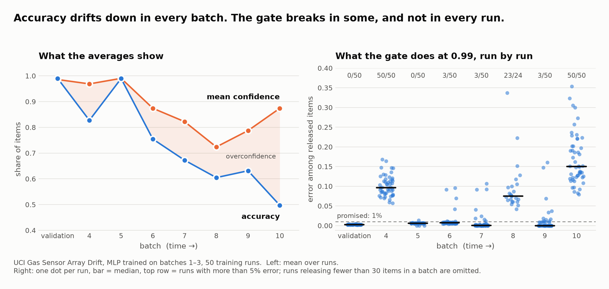

# gate-under-drift

**Does a confidence gate survive sensor drift — and can you tell, without
labels, when it has stopped working?**

A confidence gate is the rule behind virtual metrology: *if the model is at
least 99% sure, release the item unmeasured; otherwise measure it.* Its whole
value is the measurements it saves, so the question that matters is not how
accurate the model is, but whether the items it releases are still as good as
promised after the process has drifted.

This repository tests that on two public sensor datasets with real, undesigned
drift over time. It is the companion to a study of the same question on a
fine-tuned language model ([`jevlike`](https://github.com/mustafasemi-ai/jevlike)).

Everything runs on a laptop, from two downloads off the UCI repository.

<picture>
  <source media="(prefers-color-scheme: dark)" srcset="docs/gate-dark.png">
  
</picture>

---

## What was found

Gas Sensor Array Drift dataset: 13,910 measurements, 16 chemical sensors, six
gases, 36 months in ten batches. A small MLP is trained on batches 1–3 and the
gate is set at 0.99. Fifty independent training runs.

### 1. Validation cannot tell which model's gate will hold

| | in validation | after drift |
|---|---|---|
| accuracy, across 50 runs | 0.987 – 0.992 | 0.622 – 0.649 |
| error among released items, across 50 runs | 0.0015 – 0.0043 | 0.030 – 0.176 |

In validation the fifty runs are interchangeable. After drift their accuracy
still agrees to within a point, but the error among the items they *release*
differs by a factor of six. The gate's own validation error does not predict
its later error (rank correlation +0.20, not significant; between −0.12 and
+0.20 across three thresholds and two model types).

### 2. Miscalibration and gate failure are different events

| batch | accuracy | error among released | runs with a broken gate (> 5%) |
|---|---|---|---|
| validation | 0.990 | 0.002 | 0 of 50 |
| 4 | 0.827 | 0.096 | 50 of 50 |
| 5 | 0.990 | 0.006 | 0 of 50 |
| 6 | 0.754 | 0.007 | 3 of 50 |
| 7 | 0.672 | 0.001 | 3 of 50 |
| 8 | 0.605 | 0.075 | 23 of 24 |
| 9 | 0.631 | 0.000 | 3 of 50 |
| 10 | 0.497 | 0.150 | 50 of 50 |

Accuracy is the mean over runs, error among released the median. In batches 6, 7 and 9
the model has lost a third of its accuracy and the gate still keeps its
promise in 47 runs of 50, by releasing fewer items. In batches 4, 8 and 10 it
fails in every run. Some failures come from the data, some from the run.

### 3. The usual label-free alarms cannot see it. Disagreement can.

Telling a broken gate from an intact one, per run and batch, without labels
(AUC; 0.5 is chance):

| signal | MLP | boosted trees |
|---|---|---|
| drift detector (can a classifier tell the batch from training data?) | 0.500 | 0.500 |
| share of items released | 0.519 | 0.494 |
| mean confidence | 0.435 | 0.474 |
| **disagreement of four companion runs on the released items** | **0.926** | 0.797 |

The drift detector scores 1.000 on every later batch, harmful or harmless: it
answers "has the data changed?", and the answer is always yes. Asking instead
whether independently trained copies of the model still agree on what is being
released separates the two. An alarm at 0.3% disputed items catches 81% of
broken gates and raises a false alarm on 2.6% of intact ones.

It ranks; it does not measure. Disagreement is 5–20 times smaller than the true
error, because the runs mostly make the same mistakes. And it needs the
companions to be independent: boosted trees, which have no random
initialisation, release items that are 35% wrong in batch 6 while agreeing on
99.8% of them.

### 4. Five runs averaged remove the lottery, not the failure

With every model releasing the same 30% of later items, the error among them
is 0.040 [0.029, 0.217] for single runs and 0.028 [0.025, 0.030] for averages
of five. The worst case disappears. The promise of 1% is still missed.

### 5. The choice of model matters more than the choice of run

MLP and boosted trees are indistinguishable in validation (accuracy 0.990 and
0.989; error among released 0.0025 and 0.0020). After drift the trees' gate is
five times worse: 0.264 against 0.052.

### What it costs to catch a failure with real measurements

Auditing a fraction of released items with a sequential test (five runs):

| audited share | failure caught | wrong items released first (median) |
|---|---|---|
| 1% | 20.5% | 160 |
| 5% | 87.6% | 82 |
| 10% | 97.2% | 51 |
| 20% | 100% | 30 |

---

## The hard case: SECOM

Semiconductor wafers: 1,567 runs, 590 sensors, 104 failures, three months.
Here nothing works, and that is the result.

- 28 models from 9 families (boosted and bagged trees, MLPs, a transformer,
  TabPFN, sequence models, classic baselines, a fine-tuned language model)
  reach an AUC of 0.49–0.74 when scored with random folds and 0.47–0.59 on the
  later period. With rows shuffled in time the gap disappears.
- No model beats "always answer pass" on accuracy.
- The random-fold score is itself optimistic: predicting strictly forward in
  time gives 0.62–0.65 where random folds give 0.71.
- A drift detector fires on every week, inside the training period too.
  Retraining every 100 wafers does not beat a model trained once.

With 28 failures in the later period, SECOM cannot support a finer question.
That is why the gas data carries the analysis above.

### Foundation models are not exempt

Two pretrained models were put through the same protocol on SECOM.

| model | AUC, random folds | AUC, later period | gate: held back vs released, before → after |
|---|---|---|---|
| TabPFN v2 (tabular foundation model), 5 seeds | **0.740** [0.72, 0.76] | 0.524 [0.45, 0.56] | 4.9× → 1.1× |
| boosted trees, 5 seeds | 0.708 | 0.571 | 3.4× → 1.5× |
| TabPFN v2, fine-tuned on the fold, 1 seed | 0.763 | 0.584 | — |
| Qwen3-1.7B + LoRA, wafer written as text, 1 seed | 0.578 | 0.538 | 1.6× → 1.2× |

The gate column is how many times more often held-back wafers fail than
released ones; 1× means the gate selects nothing.

- **TabPFN is the best model where it was trained and among the worst after
  the shift.** Its gate is also the most selective in validation and close to
  useless later. The model that looks most trustworthy loses the most.
- **Fine-tuning it changes nothing measurable**: 0.763 / 0.584 against
  0.761 / 0.562 for the untuned model on the same seed and folds.
- **A language model fine-tuned on the readings is worse than trees** on the
  same 30 sensors (0.578 against 0.671). Pretraining on text does not help
  with rows of sensor values, and 600 wafers are too few to teach it.

The language-model run lives in the companion repository, which studies the
same gate on a fine-tuned LLM across 37 text datasets.

---

## What is and is not new

Not new, and cited in [`docs/LOG.md`](docs/LOG.md): that calibration degrades
under shift (Ovadia et al., 2019); that equally validated models differ out of
distribution (D'Amour et al., 2020); monitoring a deployed model's risk with
sequential tests (Podkopaev and Ramdas, 2022); disagreement as a label-free
estimate of error (Jiang et al., 2022) and its weakness under shift (Kirsch
and Gal, 2022); sampling decisions and the reliance index in virtual metrology
(Cheng et al., 2008, 2015); and the collapse of SECOM models under
time-ordered evaluation, reported in several public repositories.

What this adds is the combination, on open data and end to end: the gate
rather than the average as the object of study, the separation of data-caused
from run-caused failures over fifty runs, and disagreement tested as an alarm
for the gate specifically, with the case where it fails.

No claim is made that any of this is new to the literature. Only abstracts
were read, and the search was brief.

---

## How it was done

[`docs/LOG.md`](docs/LOG.md) is the working log, in the order things happened.
It includes the wrong turns: two results first reported from a single seed and
later corrected, an in-domain score that turned out to be optimistic, and two
ideas proposed as new that the literature already had.

An AI coding assistant (Claude Code) wrote all of the code and is listed as
co-author on the commits; I did not write code. It also proposed the two
datasets and most of the experiments, and it set up the evaluation protocol
(cross-fitting, the random-split controls, the metrics) on its own.

My part was the direction. Nothing ran without my go-ahead, and at each step
I decided what to ask next: more model families, an easier dataset, a
separate repository, checks against the literature, verification of every
citation. Some of the ideas were mine outright: building something aimed at
this field in the first place, fine-tuning the tabular foundation model, the
staged processing that made one memory-bound run possible, and the question
that led to the disagreement signal — not "is there drift?" but "is it strong
enough to break the model?"

It was built in the days before a job application, as an extension of the
companion repository to the field the position is in.

---

## Reproduce

```bash
uv sync                          # add --extra boosting --extra tabpfn for secom_archs.py
uv run python scripts/get_data.py

# gas sensors
uv run python scripts/gas_seeds.py                 # 50 runs: spread, predictability, ensembles
uv run python scripts/gas_seeds.py --arch gbdt --cache runs/gas/seeds_gbdt.npz
uv run python scripts/gas_disagreement.py          # label-free alarm (uses the cache above)
uv run python scripts/gas_study.py --seed 1        # one run, batch by batch
uv run python scripts/gas_audit.py                 # audit budget (needs gas_study output)
uv run python scripts/plot_gate.py                 # the figure above (needs matplotlib)

# SECOM
uv run python scripts/secom_study.py               # one model, chronological split
uv run python scripts/secom_study.py --random-split   # the control
uv run python scripts/secom_archs.py               # the model comparison
uv run python scripts/secom_drift.py               # drift detector by week
uv run python scripts/forward_checks.py            # strictly-forward evaluation, both datasets
uv run python scripts/synth_wafers.py              # simulator: which shift gives which symptom
```

`gas_seeds.py` trains 50 small MLPs in a few minutes on a GPU and caches their
predictions; every analysis after it runs from the cache in seconds.

## Limitations

- **One dataset carries the main findings.** Nothing here has been checked on
  a second drifting dataset where the model works to begin with.
- **Rows inside a gas batch have no time order**, so the batch is the unit of
  time and streams are shuffled within it.
- **The gas data may flatter the in-domain score.** Leaving a whole training
  batch out gives 0.79–0.98 instead of 0.99; a related dataset from the same
  group is known to have gases recorded in temporal clusters.
- **No hyperparameter search anywhere.** One reasonable setting per model.
- **"Broken" means more than 5% error among released items**, chosen once.
- **The fine-tuned language model on SECOM** lives in the companion repository
  and was run with one seed.

## License

MIT. The datasets carry their own terms; see the references in
[`docs/LOG.md`](docs/LOG.md).
